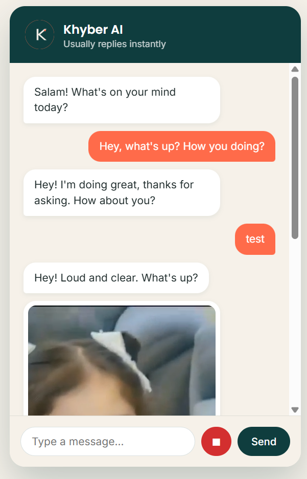
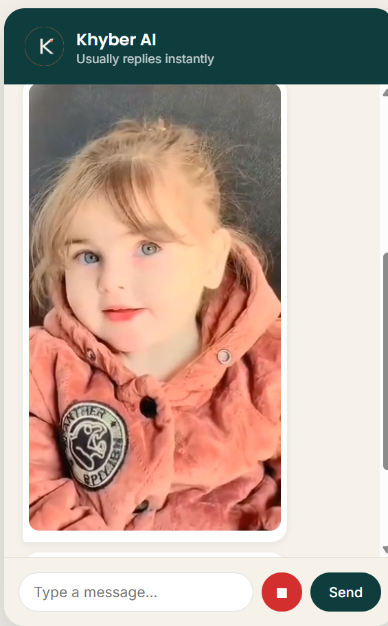

# Khyber AI — Your Personal Assistant Chatbot

## What is this?
Khyber AI is a friendly chat assistant for your website. It talks to your customers instantly, answers common questions, shows product videos when asked, and can even understand and reply using voice messages.

## What can it do?
- **Answer questions instantly** — no waiting for a human reply
- **Show product videos** — when a customer asks about an item (like "show me the red dress"), it can send a video right in the chat
- **Understand voice messages** — customers can speak instead of type, and the assistant replies back
- **Speaks your customers' language** — works in English, Urdu, and Pashto
- **Always available** — replies any time, day or night

## How do I customize it for my business?
Everything is controlled through one simple settings file — no coding needed:
- **Assistant name & greeting** — change what it's called and how it greets customers
- **FAQ answers** — add your own common questions and answers (hours, location, policies, etc.)
- **Product videos** — add a video and a few keywords for each product; when a customer mentions that product, the video shows automatically

## How do I add it to my website?
Send us your website details and we'll handle the setup — no technical work needed on your end.

## Questions or changes?
Just reach out anytime — new products, FAQs, or features can be added quickly.

## Screenshots

## Works for Any Business Type
This same setup works for more than just retail stores — the structure stays the same, only the content changes:
- **Clothing/general store** — product FAQs, delivery, returns
- **Clinic** — appointment hours, services offered, doctor availability
- **Salon** — service menu, pricing, booking hours
- **Restaurant** — menu, hours, delivery/takeout info

To adapt it for a different business, just update the greeting and FAQ answers in the settings file — no coding required.